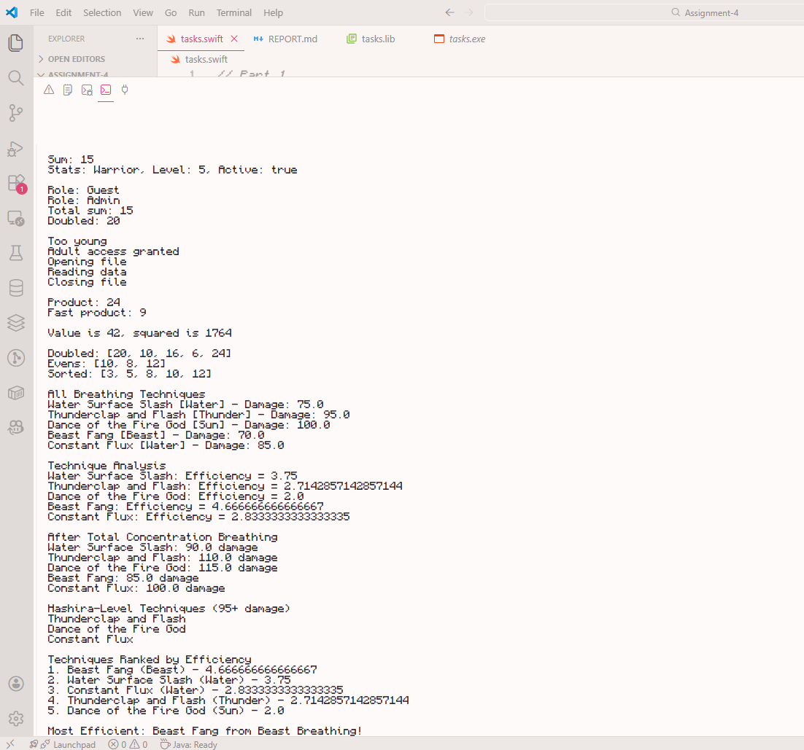

# Assignment 4 - Functions and Closures in Swift

## Introduction

This assignment was about practicing functions and closures in Swift. For me, it was pretty chill and understandable because I already have some programming background, especially with Python. Most of the ideas weren’t new, but this task helped me get more comfortable with Swift syntax and how closures are used in real code.

See the code by going to **task.swift** in this dir.

In order to run the code type this:

## Part 1: Basic Functions

In this part, I worked with simple functions. I created one function that prints a welcome message and another one that prints a personalized greeting using a parameter. I called the function with different names just to see how it behaves. Nothing special here, just basic Swift function practice.

**Q1: What is a function in Swift?**  
**Answer:**  
A function in Swift is a reusable block of code that performs a specific task.

**Q2: Why are functions useful in programming?**  
**Answer:**  
They help organize code, avoid repetition, and make programs easier to read and maintain.

## Part 2: Parameters & Return Values

Here I worked with functions that return values. I created a function that adds two numbers and returns the result, then stored it in a variable and printed it. After that, I made a function that returns multiple values using a tuple. This felt very similar to Python, so it was easy for me.

**Q1: What does the `return` keyword do?**  
**Answer:**  
It sends a value back from the function to the place where it was called.

**Q2: Can a function return more than one value? How?**  
**Answer:**  
Yes, by using a tuple, which allows returning multiple values together.

## Part 3: Default, Variadic & In-Out Parameters

In this part, I tried different parameter types. I used a default parameter for roles, a variadic parameter to sum multiple numbers, and an in-out parameter to modify a variable directly. This part showed how flexible Swift functions can be.

**Q1: Why are default parameters useful?**  
**Answer:**  
They allow you to call a function without always passing arguments, which saves time.

**Q2: What does the `inout` keyword allow a function to do?**  
**Answer:**  
It lets a function modify the original variable passed into it.

## Part 4: Flow Control Inside Functions

Here I used flow control inside functions. I applied `guard` to validate input, `return` to exit early, and `defer` to run code when the function finishes. This part helped me understand how Swift handles safe logic.

**Q1: What is the main purpose of `guard`?**  
**Answer:**  
It checks conditions early and exits the function if the condition is not met.

**Q2: When is `defer` useful?**  
**Answer:**  
It’s useful when you want something to always run at the end of a function.

## Part 5: Closures Basics

In this part, I worked with closures. I created a closure that multiplies two numbers, stored it in a variable, and rewrote it using shorthand arguments. Closures in Swift feel very similar to lambdas in Python.

**Q1: What is a closure in Swift?**  
**Answer:**  
A closure is a block of code that can be stored in a variable and passed around.

**Q2: How is a closure different from a function?**  
**Answer:**  
Closures can be anonymous and written inline, unlike named functions.

## Part 6: Closures as Function Parameters

Here I passed a closure as a parameter into a function and used a trailing closure syntax. The closure processed an integer and printed the result. This pattern is very common in Swift and easy to use once you get used to it.

**Q1: Why are closures often passed as function parameters?**  
**Answer:**  
They allow flexible behavior without rewriting the function.

**Q2: What does `Void` indicate in a function?**  
**Answer:**  
It means the function does not return any value.

**Q3: What does it mean that a closure “captures values”?**  
**Answer:**  
It means the closure can use variables from outside its own scope.

## Part 7: Functional Programming (map, filter, sorted)

In this part, I used `map`, `filter`, and `sorted` on an array of integers. I transformed values, filtered even numbers, and sorted the list. This part was very easy because the logic is similar to Python.

**Q1: What is the difference between `map` and `filter`?**  
**Answer:**  
`map` transforms elements, while `filter` keeps elements based on a condition.

**Q2: What does `map` do?**  
**Answer:**  
It applies a transformation to each element in a collection.

## Part 8: Practical Challenge — Skill System

For the creative part, I built a small skill system inspired by anime Demon Slayer, breathing techniques. I used structs, functions, closures, and functional programming methods like map, filter, and sorted. I calculated efficiency, boosted damage, filtered strong techniques, and ranked them. This part felt the most fun and practical.

## Overall Conclusion

Overall, this assignment was pretty easy for me. Most concepts were already familiar, but I still learned more about Swift-specific syntax and closures. Everything worked smoothly, and the task was actually enjoyable to complete.

